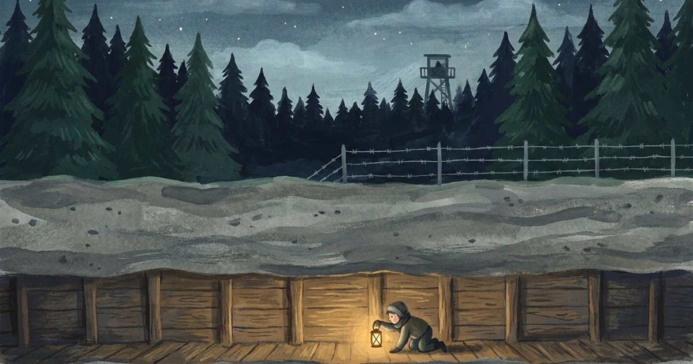

# G FOR GEORGE — the tunnels of Stalag Luft III

**Play it: https://kylefriesmarketing.github.io/george/**

Silesia, 1943. Your Lancaster fell over Essen; you and your navigator are all that's left
of her crew. In the Luftwaffe's escape-proof camp, six hundred officers are digging three
tunnels at once — and the one under the stove in Hut 104 needs 336 feet.

**The events are true. The names are changed. The last page has the real ones.**

It is told, fifty years on, by the last man of Hut 104, to his friend's granddaughter — and
the way you replay it is the way he retells it, until it comes out true.

## Three true books, one frame

- **Book One — the tunnels.** The Great Escape, beat for documented beat: three tunnels, the
  yellow sand, the theatre, the frozen trap, the exit ten feet short of the trees, the shot at
  man seventy-seven — and the typed list that grew for a week and stopped at fifty. Its dark
  endings are the counterfactuals the survivor still deals himself at 3 a.m.
- **Book Two — the horse.** The Wooden Horse escape, the one that worked clean, all three men
  home. Here the licence inverts: history is fixed as *success*, so the flinches are the lies —
  and the granddaughter corrects the record.
- **Book Three — the relay.** The long way home across occupied Europe, told to read the
  *helpers* into the record — the schoolmistress, the courier girl, the priest, the guide, and
  the two never named. It ends on the Ledger of Hands.

Tell all three and answer the roll, and the frame's last room opens: **The Keeper.**

## What makes it tick

- **The tunnel is the meter** — the shelf's first *constructive* resource: feet accumulating
  across a year of camp-time, traded against HEAT (the ferrets), NERVE (the men), KIT (escape
  readiness) and THE CREW (your navigator).
- **Fixed history, free thread** — the big beats happen on schedule; where *your* number falls
  in them is yours to play. Wrong is a branch, not a retry.
- **Replay is retelling** — every telling is written into her notebook (rename them yourself);
  witness each man's story across retellings to earn the true endings.
- 15 tellings · 32 Mentions in Dispatches · the Log with portraits · the Kriegie Glossary · and
  an afterword, **"The Fifty,"** that tells all three true stories straight, with the real names.

## Playing

- Press **1–9** to choose (turn on the number badges in Options if you like them shown).
- **~** opens the lantern (debug), **m** mutes, **Esc** closes any panel.
- **Options** holds text size, prose speed (instant / unfurl / typewriter), high contrast,
  **Cold Telling** (the ledger hidden — he never saw the meters either), and **the notebook
  keeps**: a progress code you can copy and carry to another device. Restoring only ever *adds*.
- Accessible: keyboard-navigable with a visible focus ring, screen-reader passage announcements,
  and full `prefers-reduced-motion` / `prefers-contrast` respect.

## Under the hood

Vanilla JS — no frameworks, no build step. All music is WebAudio synthesis (including the
relay theme, one phrase passed voice to voice, and the silent leitmotif of the list). Scene
paintings are gouache-style, each with a hand-drawn procedural SVG fallback, so the game is
whole with or without the art. Graph integrity is proven by `window.__ggSoak(n)`.

Part of [THE SHELF](https://kylefriesmarketing.github.io/games/).

---

*This story is fiction built on a true frame. The names in the game were changed. The real ones
are kept for the last page — Bushell, Walenn, Floody, von Lindeiner; Williams, Codner, Philpot;
van der Stok, and the countless helpers of the escape lines who were never named at all.*
